# System Design

A holistic, top-down view of **NearAid** — how the client, the external backend, and the
device's own radios/ML tie together, and the end-to-end flows that cut across the modules.
Where [architecture.md](architecture.md) explains the *code* layering, this doc explains the
*system*: what the moving parts are, who talks to whom, and how a request travels from a tap to
a byte on the wire and back.

> Diagrams below are Mermaid — they render inline on GitHub and in the docs viewer.

---

## 1. System context

NearAid is a **hyperlocal mutual-aid** app (পাশের মানুষ — "the person beside you"): a two-sided
board connecting people who *need* everyday help with nearby neighbours willing to *give*. **No
money changes hands.** This repo is the **Android client**; the backend is a separate service.

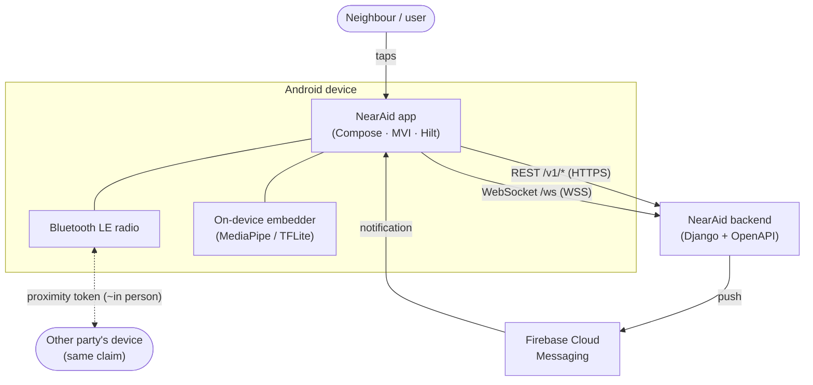

**Trust boundary.** Everything inside *Device* is the client's responsibility; everything at
*Backend* / *FCM* is external and untrusted from the client's point of view (all responses pass
through `safeApiCall` → `DataResult`, never raw exceptions). The **BLE link is peer-to-peer** —
it never touches the backend; it only proves two people are physically together.

**External dependencies**

| Dependency | Protocol | Purpose |
|---|---|---|
| NearAid backend | REST `https://api.nearaid.app/v1/` | source of truth — listings, claims, chat, users, safety |
| NearAid backend | WebSocket `wss://api.nearaid.app/ws` | realtime chat delivery (best-effort) |
| Firebase Cloud Messaging | FCM | push notifications → deep links |
| A peer device | Bluetooth LE | in-person handoff confirmation (no server involved) |

Debug builds point at `http://10.0.2.2:8000` / `ws://10.0.2.2:8000/ws` (emulator → localhost).
See [data-and-networking.md](data-and-networking.md#networking-corenetwork) for the full URL/env table.

---

## 2. Component view

The client is a **19-module** Gradle project (Clean Architecture + MVI). At the system level the
modules collapse into five responsibilities; the dependency rule points inward (UI → domain ← data).

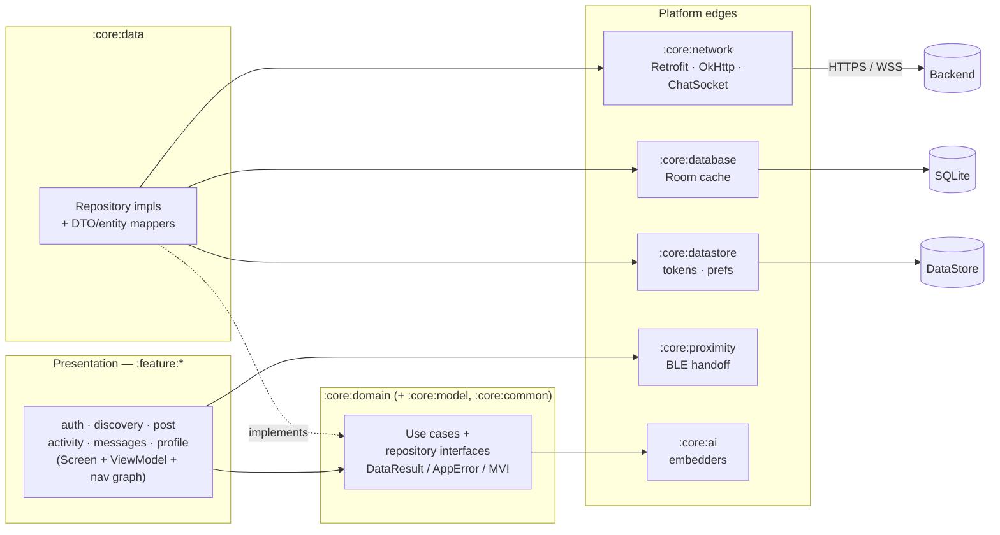

- **Features** never depend on each other — they meet only through `:core:domain` and the shared
  `Routes.kt` registry ([navigation.md](navigation.md)).
- **Repositories** are the only place I/O happens: `withContext(IO) { safeApiCall { … } }`,
  returning `DataResult`. Room is a **fallback cache** (write-on-first-page, read on network
  failure), not a write-through store.
- **`:core:proximity`** and **`:core:ai`** are self-contained platform capabilities used by
  `:feature:activity` and the discovery use case respectively.

Full module table: [architecture.md](architecture.md#layers--dependency-direction).

---

## 3. Request lifecycle (the spine every flow shares)

Every screen action runs the same round trip. Understanding this once explains all the flows in §4.

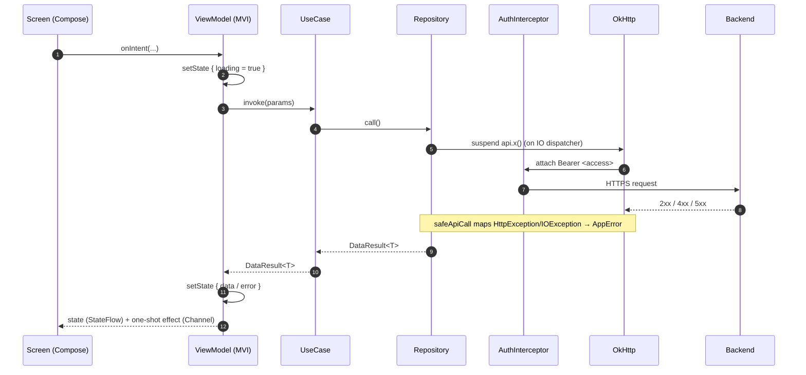

- **State** (`StateFlow`) is the durable screen model; **effects** (`Channel`, never replays) are
  one-shots — navigation, snackbars, scroll-to-top. UI collects effects via `CollectEffect` gated
  at `STARTED`.
- **401 handling is transparent** to everything above OkHttp: `TokenAuthenticator` refreshes and
  retries the request (see §4.1). Callers only ever see `DataResult`.

---

## 4. End-to-end flows

### 4.1 Authentication & session — phone OTP + silent refresh

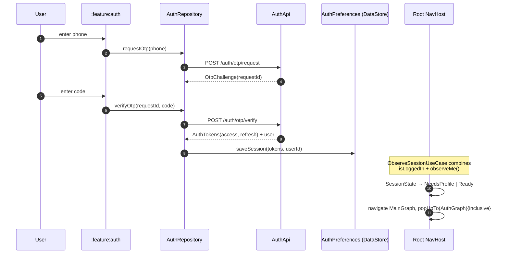

**Session state machine** (`ObserveSessionUseCase`) drives which graph the app shows:

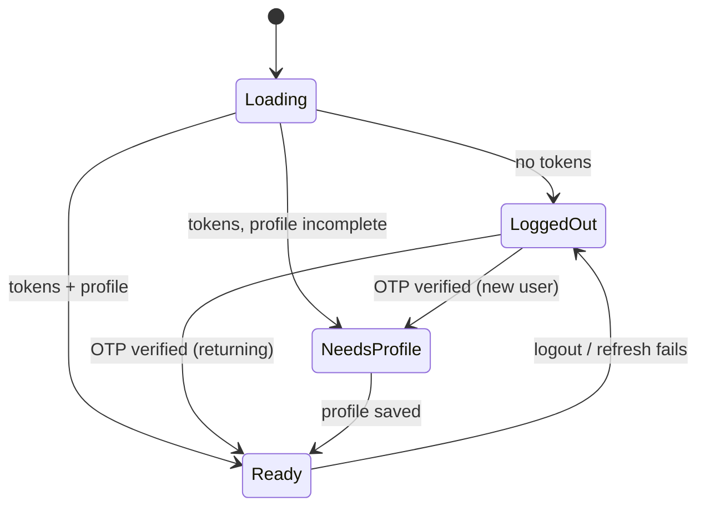

**Silent refresh.** `AuthInterceptor` attaches `Bearer <access>` to every non-`/auth/` request.
On a `401`, OkHttp invokes `TokenAuthenticator`: `synchronized` (concurrent 401s don't
double-refresh), gives up after 2 attempts, calls `AuthApi.refresh` (injected as
`dagger.Lazy` to break the Retrofit⇄Authenticator cycle), stores the new access token, and
retries the original request — or `clear()`s the session, forcing re-login. Details:
[data-and-networking.md](data-and-networking.md#auth--token-refresh).

### 4.2 Discovery — nearby feed + on-device semantic re-rank

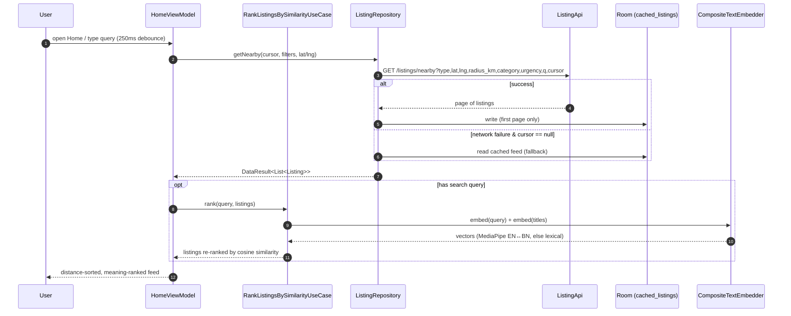

- **Location is privacy-fuzzed** before it goes out; the feed is distance-sorted.
- **Semantic search runs entirely on-device** — a search for "baby formula" surfaces "surplus
  infant milk powder". `CompositeTextEmbedder` prefers the MediaPipe multilingual model and falls
  back to a dependency-free lexical embedder, so it works with zero setup and auto-upgrades when
  the `.tflite` asset is bundled. Full design: [ai-semantic-search.md](ai-semantic-search.md).
- **Cursor-based paging**; cache is read only as a first-page fallback on failure.

### 4.3 The core lifecycle — claim → chat → deliver → confirm → rate (with BLE)

This is the app's central flow and the one system feature worth understanding in full. A listing
is claimed, the two parties chat to arrange the handoff, meet in person (confirmed over BLE), mark
it delivered, the owner confirms receipt, and both rate.

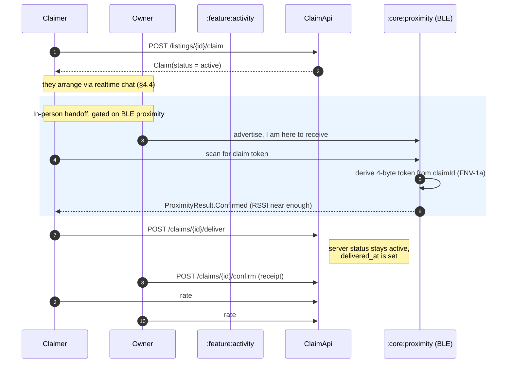

**Claim status is derived, not a raw field.** The backend keeps `claim.status = active` even
after delivery; "delivered" lives on the `delivered_at` timestamp. The client reconstructs the
UI-facing state with `claimStatusOf(status, deliveredAt)` (in `Mappers.kt`), yielding
`ClaimStatus.DELIVERED` when `delivered_at` is present. The `/me/claims` endpoint returns nested
`MyClaimDto` for the owner-side view. The full enum is
`ClaimStatus { ACTIVE, DELIVERED, WITHDRAWN, COMPLETED, CANCELLED }` (`core/model/Enums.kt`); the
REST transitions are `POST /claims/{id}/{deliver|confirm|withdraw|rating}`.

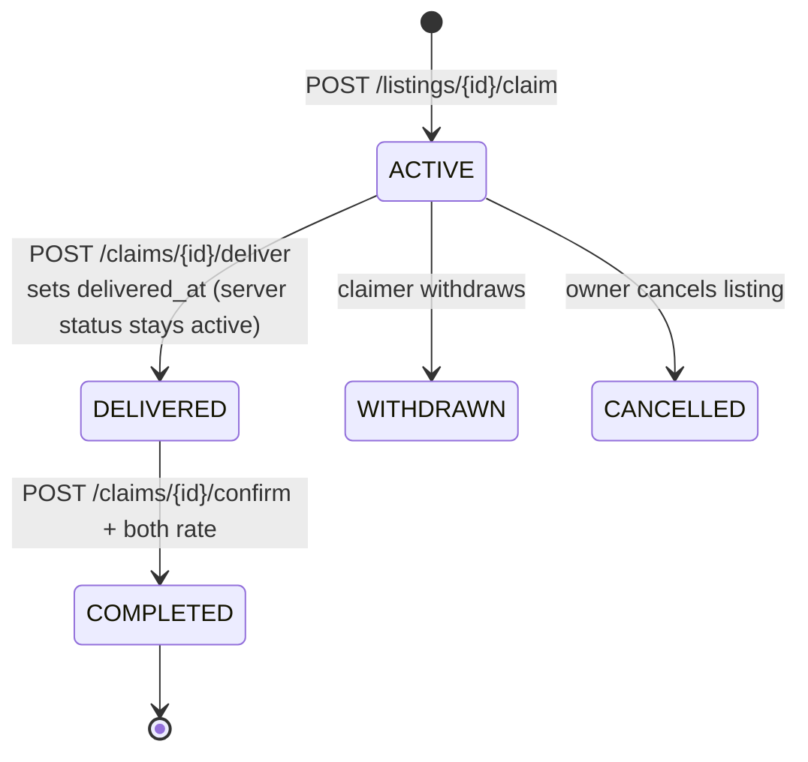

**BLE proximity confirmation** (`:core:proximity`) — how "you two are actually together" is proven
without a server, and how it degrades:

- Both devices derive the **same 4-byte token** from the claim id (FNV-1a hash). One device
  **advertises** the token in a service-data-only legacy advertisement (kept under the **31-byte**
  limit — this was the hardware bug that got caught), the other **scans**; a near-enough **RSSI**
  match resolves `ProximityResult.Confirmed`. Foreground-only.
- **Config** (`ProximityConfig`): 20 s timeout, `-70 dBm` near-RSSI threshold, custom 128-bit
  service UUID `6e617261-6964-4841-4e44-4f46460001a0`, low-latency non-connectable advertising.
  `ProximityResult` is a sealed type: `Confirmed(rssi)` · `Timeout` · `Unavailable` ·
  `PermissionDenied` · `Error`. Permissions branch on API level (`BLUETOOTH_SCAN`/`ADVERTISE` on
  12+, `ACCESS_FINE_LOCATION` below).
- **Graceful degradation:** BLE off → `Unavailable` → proceed with manual confirm; can't confirm →
  manual-confirm fallback. The receiving party can advertise ("I'm here to receive").
- **Testing caveat:** the radio flow needs two real phones (only the pure `isHandoffMatch`
  predicate + token derivation are unit-tested); every scanning phone needs system **Location** on
  or Android silently drops BLE scan results. See the *ble-hardware-proof* notes and
  [testing.md](testing.md).

### 4.4 Realtime chat — WebSocket over a REST source of truth

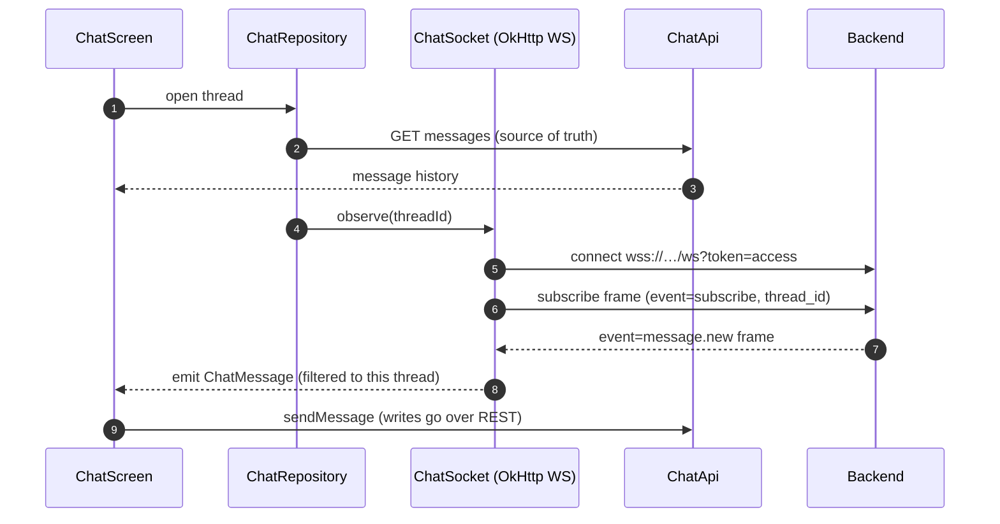

- **REST is the source of truth**; the socket is **best-effort with no reconnection**. A dropped
  socket degrades gracefully because history/refresh always come from `getMessages`.
- The socket is a `callbackFlow` emitting only `event == "message.new"` frames for the subscribed
  thread. Sends, read-receipts (`markRead`), and the conversation list are all REST.
- A **safety bar** (report/block) rides on top of the chat UI. Details:
  [data-and-networking.md](data-and-networking.md#realtime-chat-chatsocket).

### 4.5 Push notifications — FCM → deep link

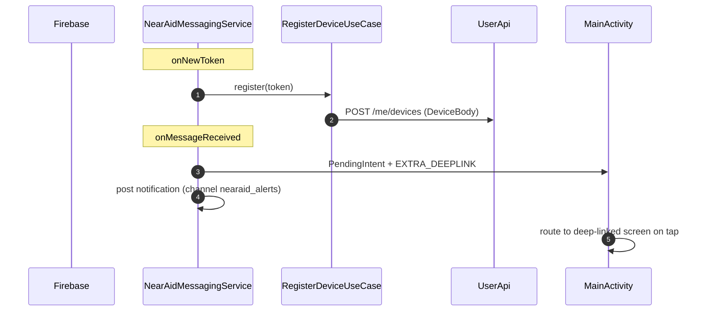

FCM tokens are registered against the account on refresh; incoming messages become a tappable
notification that deep-links into the relevant screen (a claim, a chat, etc.).

---

## 5. Data flow & storage tiers

| Tier | Store | What lives here | Lifetime |
|---|---|---|---|
| **Remote** | Backend (Django) | source of truth: listings, claims, chat, users, safety | authoritative |
| **Cache** | Room `nearaid.db` (v1, destructive migration) | `cached_listings`, `cached_conversations` | disposable, fallback-only |
| **Prefs** | Preferences DataStore `nearaid_prefs` | access/refresh tokens, user id, language, `search_radius_km` (5.0) | until logout / clear |
| **Ephemeral** | in-memory `StateFlow` | current screen state | process lifetime |

**Caching policy:** write-on-first-page, read only when the network call fails and `cursor == null`.
Messages, claims, profile, and notifications are **not** cached — they're always live. The DB is
intentionally disposable (single version, `fallbackToDestructiveMigration`).

**Client ↔ server contract:** all wire models are `@Serializable` snake_case DTOs
(`dto/Dtos.kt`); the error envelope is `{"error":{code,message,details}}`, decoded by
`toAppError()` and mapped status→`AppError` (`401→Unauthorized`, `409→Conflict`, `429→RateLimited`,
`5xx→Server`, …). Eight Retrofit services cover the surface: `AuthApi`, `UserApi`, `CategoryApi`,
`ListingApi`, `ClaimApi`, `ChatApi`, `SafetyApi`, `NotificationApi`.

---

## 6. Cross-cutting qualities

| Concern | How it's addressed |
|---|---|
| **Resilience / offline** | `DataResult` everywhere (no thrown exceptions to the UI); Room fallback for feed + conversations; best-effort WebSocket with REST fallback; BLE degrades to manual confirm |
| **Concurrency** | Injected dispatchers (`Default`/`IO`/`Main`); repositories on `IO`; embedder on `Default`; `synchronized` token refresh |
| **Security** | Bearer + silent refresh; HTTPS/WSS in release; `Authorization`/`Cookie` headers redacted in logs. **Known gap:** tokens sit in plain DataStore — harden with Keystore/`EncryptedFile` before production |
| **Privacy** | Location is fuzzed before leaving the device; semantic search is 100% on-device (nothing leaves the phone); BLE handoff is peer-to-peer, no server |
| **Accessibility** | TalkBack roles/labels/headings, 48 dp targets, live-region announcements, enforced by an automated Compose a11y test — [design-system-and-accessibility.md](design-system-and-accessibility.md) |
| **Localization** | Bangla + English, dark/light semantic theming |
| **Performance** | ~1.6 s cold / ~0.37 s warm startup (physical low-end device, Macrobenchmark); ~16 s cold / ~1 s incremental build |
| **Quality gates** | 273 unit tests, 84.7% core-logic coverage (JaCoCo, logic-filtered); CI on every push/PR — [testing.md](testing.md) · [ci-cd.md](ci-cd.md) |

---

## 7. Deployment topology

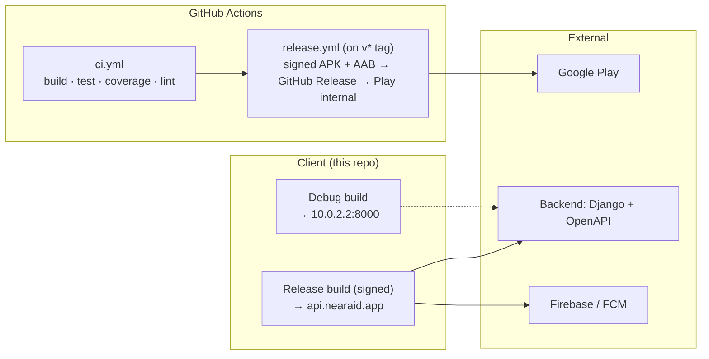

The **backend is deployed independently** (Django + OpenAPI, out of this repo). The client ships
through GitHub Actions: `ci.yml` gates every push/PR (build → unit tests → JaCoCo → lint);
`release.yml` on a `v*` tag builds a signed APK + AAB, cuts a GitHub Release, and (with a Play
service account configured) pushes the AAB to Play's internal track. See
[ci-cd.md](ci-cd.md).

> **KMP variant.** A parallel Kotlin Multiplatform line of the same product lives on the `KMP`
> branch — shared Compose Multiplatform UI on Android + iOS, Koin + Ktor + Room-KMP. Same system
> design; different platform edges. See `near_aid_main_report.md` (Appendix B).

---

## See also

- [Architecture](architecture.md) — code layering, MVI, DI, convention plugins
- [Data, networking, auth & realtime](data-and-networking.md) — the wire-level detail behind §3–§5
- [Navigation](navigation.md) · [Design system & accessibility](design-system-and-accessibility.md)
- [AI — on-device semantic search](ai-semantic-search.md) · [Testing](testing.md) · [CI/CD](ci-cd.md)
